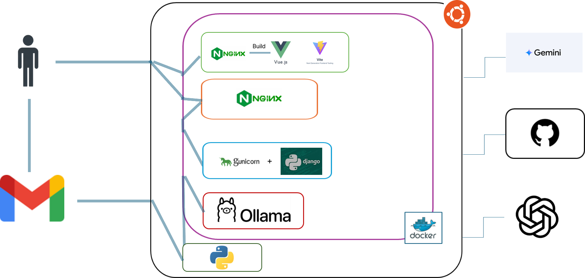

# Newsis Newsletter

## 👉[Newsis-Newsletter 사용해보기][Newsis-link]

[Newsis-link]: http://cats.cbnu.ac.kr:24039 'Newsis-Newsletter 바로가기!'

#### 개발 관련 소식, 쉽게 접하자!

Newsis-Newsletter는 주차별로 개발 관련 뉴스를 요약해 뉴스레터로 보여주는 사이트입니다!
---

## 프로젝트 소개

### 🛠 Architecture

### ⏰ 프로젝트 타임라인

#### 개신프론티어 프로젝트로서 진행
- 3월 4일 ~ 6월 20일 (16주)
- 5월 22일 배포

### 🚀 기능

#### 😃 원하는 뉴스레터를 간편하게

- 개발 관련 소식을 요약한 뉴스레터를, 관련된 이미지와 함께 웹사이트에서 곧바로 확인할 수 있어요!

#### 😃 정기적으로 뉴스레터 받아보기

- 이름과 이메일로 구독을 하면, 매주 월요일마다 뉴스레터를 이메일로 보내드려요!

## 🛠 Tools

#### Back-end

 

 

#### Front-end

  
  
  
   

#### Dev tools

 
  
  
  

#### AI

  
  
  

 

| 이름       | 포지션       | 개인 깃허브           |
| ---------- | ----------- | -------------------- |
| **백하준 (팀장)** | `프론트엔드` |  |
| **민태원** | `AI` |  |
| **임경택** | `백엔드` |  |

## 🔥 API
API는 [이곳](https://github.com/KIMGEEK/Newsis-Newsletter/blob/main/docs/API.md)에서 확인하실 수 있습니다!